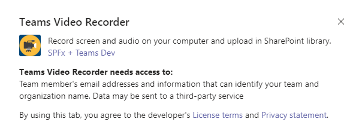
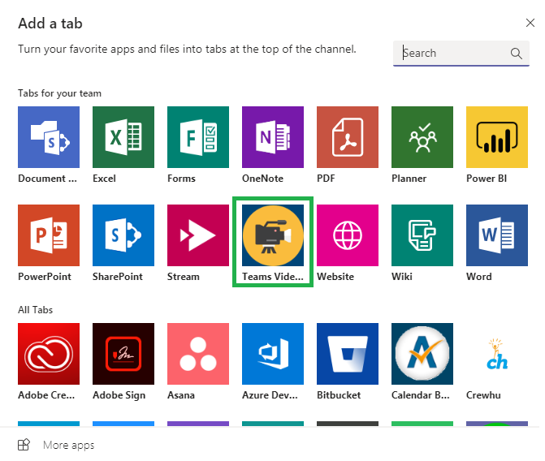
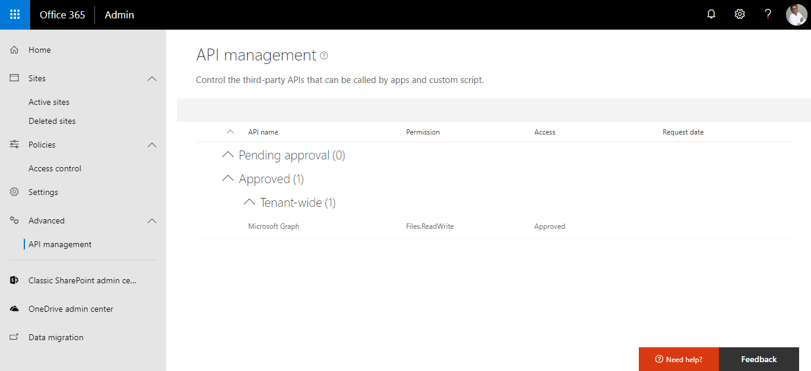
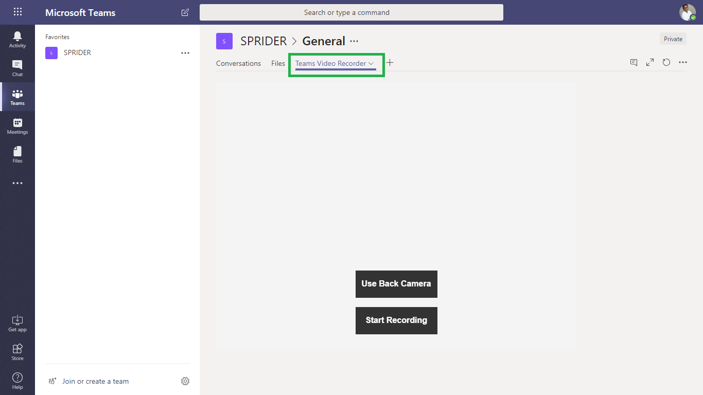

## Teams Tab Video Recorder

## Summary

Sample SharePoint Framework client-side web part for Microsoft Teams Tab illustrating Video Recording using [MediaRecorder Web API](https://developer.mozilla.org/en-US/docs/Web/API/MediaRecorder). 

This is an experimental web part. Because this technology's specification has not stabilized, check the compatibility table for usage in various browsers. Also note that the syntax and behavior of an experimental technology is subject to change in future versions of browsers as the specification changes

## Teams Custom Tab

## Teams Custom Tab

## Teams Custom Tab

## Teams Custom Tab

## Applies to

* [SharePoint Framework 1.7](https://dev.office.com/sharepoint/docs/spfx/sharepoint-framework-overview)
* [Office 365 developer tenant](https://dev.office.com/sharepoint/docs/spfx/set-up-your-developer-tenant)
* [Microsoft Teams tab](https://docs.microsoft.com/en-us/sharepoint/dev/spfx/web-parts/get-started/using-web-part-as-ms-teams-tab)

## Solution

Solution|Author(s)
--------|---------
teams-tab-video-recorder|Joseph Velliah (SPRIDER, @sprider)

## Version history

Version|Date|Comments
-------|----|--------
1.0|November 20, 2018|Initial release

## Disclaimer
**THIS CODE IS PROVIDED *AS IS* WITHOUT WARRANTY OF ANY KIND, EITHER EXPRESS OR IMPLIED, INCLUDING ANY IMPLIED WARRANTIES OF FITNESS FOR A PARTICULAR PURPOSE, MERCHANTABILITY, OR NON-INFRINGEMENT.**

---

## Minimal Path to Awesome

- clone this repo
- run npm i
- go to [this](https://docs.microsoft.com/en-us/sharepoint/dev/spfx/web-parts/get-started/using-web-part-as-ms-teams-tab) Microsoft article and follow the steps to package and deploy my sample
- Go to your tenant's [API management](https://yourtenant-admin.sharepoint.com/_layouts/15/online/AdminHome.aspx#/webApiPermissionManagement) page to approve the permission requests configured in this web part.

## Features

This project illustrates the following concepts:
- Building Microsoft Teams tab using SharePoint Framework
- Packaging and deploying web part as a Microsoft Teams tab
- Front/Back camera selection
- Video recording using the supported browsers   
- Playback recording
- Upload recorded video in user's OneDrive root folder